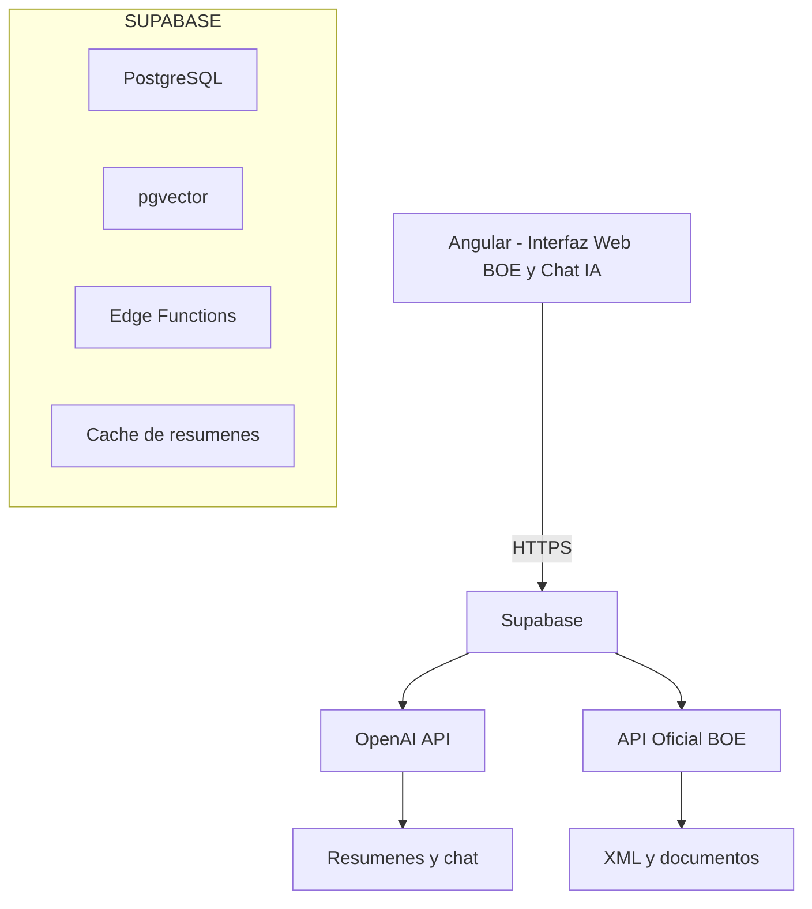
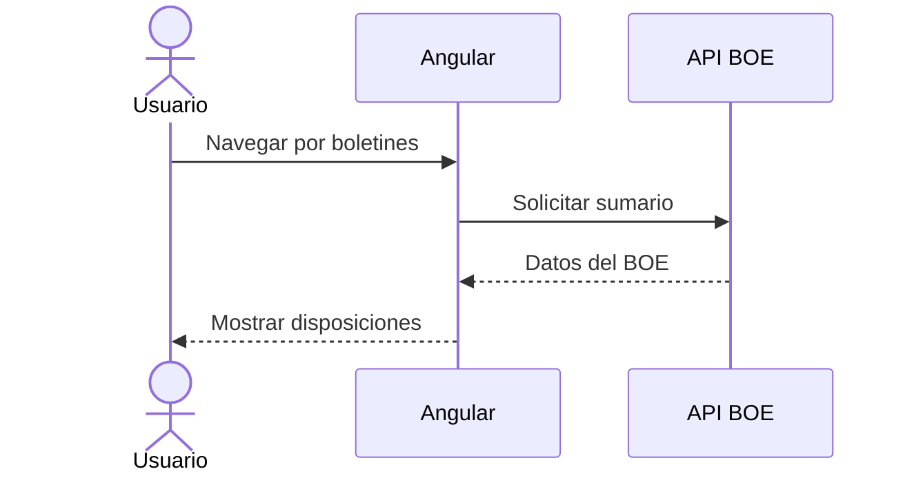
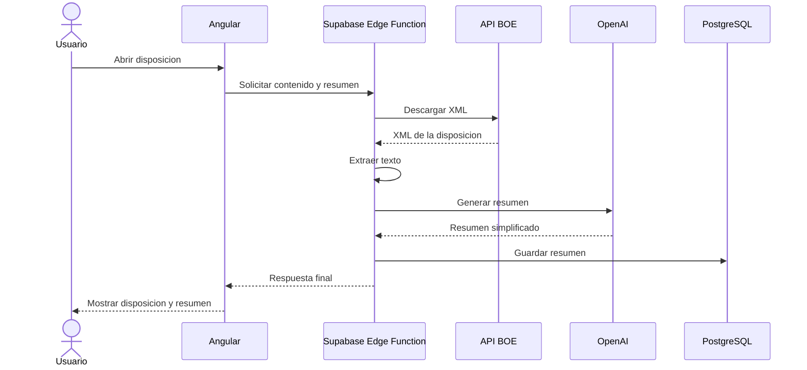
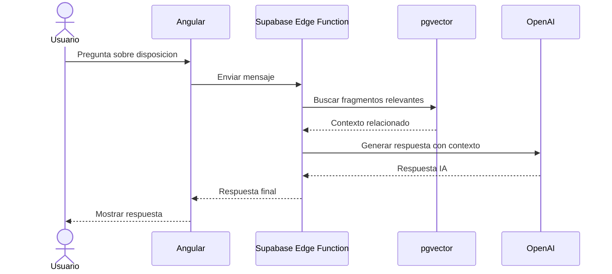
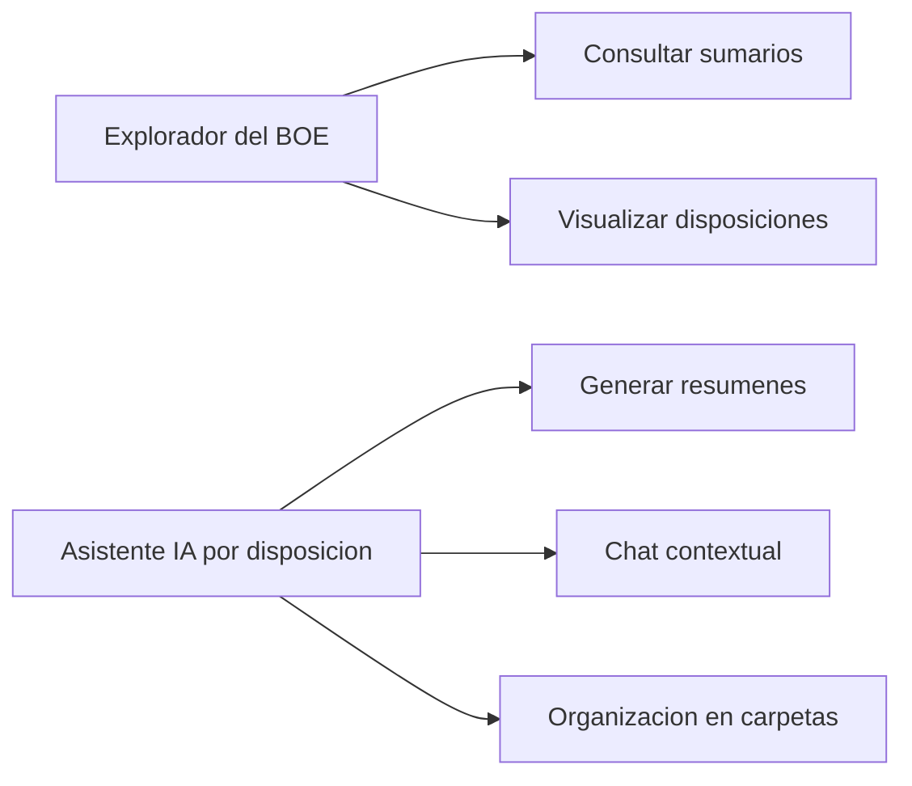
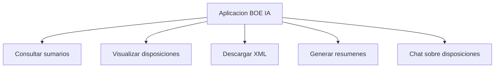

# Arquitectura del proyecto

<p align="right"><a href="../README.md">Volver al README general</a></p>

<a id="readme-top"></a>

<!-- TABLE OF CONTENTS -->
<details>
  <summary>Tabla de Contenidos</summary>
  <ol>
    <li><a href="#general">Visión General</a></li>
    <li><a href="#tech-stack">Stack Tecnológico</a></li>
    <li><a href="#project-structure">Estructura de Carpetas</a></li>
    <li><a href="#api-integrations">Integraciones con APIs</a></li>
    <li><a href="#pages">Páginas y Componentes principales</a></li>
    <li>
      <a href="#decisions">Consideraciones y decisiones</a>
      <ul>
        <li><a href="#performance">Rendimiento</a></li>
        <li><a href="#seo">SEO</a></li>
        <li><a href="#accessibility">Accesibilidad</a></li>
      </ul>
    </li>
  </ol>
</details>

<!-- Overview -->

## 1. Visión General

<p align="justify">
...
</p>

## Arquitectura general



---

## Flujo de navegacion del BOE



---

## Flujo de apertura de una disposicion



---

## Flujo del asistente IA



---

## Modelo conceptual del sistema



---

## Funcionalidades principales



<p align="right">(<a href="#readme-top">back to top</a>)</p>

<!-- Stack Tecnológico -->

<a id="tech-stack"></a>

## 2. Stack Tecnológico

Las tecnologías que usado para desarrollar el proyecto son:

- [](#) [Angular 21](https://angular.dev/overview)
  - [Modulo A11y (accesibilidad) - Angular Material CDK ](https://material.angular.dev/cdk/a11y/overview)
  - [Librería RxJS (peticiones http asíncronas)](https://rxjs.dev/guide/overview)
  - [LucideAngularModule (iconos)](https://lucide.dev/guide/packages/lucide-angular)
- [](#) [HTML5](https://www.w3schools.com/html/html_intro.asp)
- [](#) [CSS3](https://lenguajecss.com/)
- [](#) [TypeScript](https://www.typescriptlang.org/docs/)

<p align="right">(<a href="#readme-top">back to top</a>)</p>

<!-- Estructura de Carpetas -->

<a id="project-structure"></a>

## 3. Estructura de Carpetas

```text
.
├── docs/ - Documentación técnica
├── public/ - Archivos públicos estáticos
│   └── assets/ - Recursos (imágenes, logos, etc.)
├── src
│   ├── app
│   │   ├── core/ - Lógica central y reutilizable de la App
│   │   │   ├── guards
│   │   │   ├── interceptors
│   │   │   ├── models
│   │   │   ├── pipes
│   │   │   └── services
│   │   ├── environments/ - Configuraciones de entorno
│   │   ├── pages/ - Páginas o vistas (algunas contienen componentes anidados)
│   │   │   ├── home
│   │   │   ├──
│   │   │   ├──
│   │   │   ├──
│   │   │   ├──
│   │   │   └──
│   │   └── shared/ - Componentes(UI) y utiles globales
│   │       ├── components
│   │       └── utils
```

<p align="right">(<a href="#readme-top">back to top</a>)</p>

<!-- Integraciones con APIs -->

<a id="api-integrations"></a>

## 4. Integraciones con APIs

### 4.1. Api del BOE

Para esta aplicación utilizamos la api publica del boe para utilizar sus datos y mostrarlos
de maneras variopintas con la intención de que sea más intuitivo para los usuarios que no dominan el lenguaje técnico 
de los BOE añadimos la función de un asistente de IA para preguntarle sobre el lenguaje utilizado y su significado o cualquier
cosa que se le ocurra al usuario.

#### Servicio implementado para integrar: (./src/app/core/services/boe-service.ts)

```typescript
private http = inject(HttpClient);
  private apiUrl = environment.boeapiUrl;
  public getDailySummary(date: string |null): Observable<HttpResponse<BoeDataResponse>> {
    return this.http.get<BoeDataResponse>(this.apiUrl + `/${date}`, {
      observe: 'response',
    });
  }
```

#### Detalles de la implementación:

- **Filtrado de campos:**
- **Modelado de datos:**

<p align="right">(<a href="#readme-top">back to top</a>)</p>

### 4.2. Boe4all API (API propia - Supabase)

...

#### Servicios implementados para integrar: (click a los enlaces para ver el código)

- (lista links a codigo)
-

#### Configuración Base de Supabase

- (lista de movidas de config.)
-

#### Endpoints Principales

##### Autenticación y Cuenta

Es la parte encargada de gestionar quién entra en la app. Al hacer login, la API responde con un token que se guarda en el localStorage y se usa en las siguientes peticiones.

| Método     | Endpoint    | Descripción                       | ¿Auth? |
| ---------- | ----------- | --------------------------------- | ------ |
| **POST**   | `/register` | Crea un usuario nuevo.            | No     |
| **POST**   | `/login`    | Entra y recibe el `access_token`. | No     |
| **GET**    | `/user`     | Trae datos de usuario.            | **Sí** |
| **DELETE** | `/user`     | Elimina cuenta definitivamente.   | **Sí** |

##### Reseñas (Reviews)

Estos endpoints permiten que los usuarios posteen sus reseñas de los países. Se pueden filtrar por país usando el codigo cca3 (ej: `ESP`).

| Método     | Endpoint        | Descripción                                      | ¿Auth? |
| ---------- | --------------- | ------------------------------------------------ | ------ |
| **GET**    | `/reviews`      | Ver todas las reseñas (puedes filtrar por país). | No     |
| **POST**   | `/reviews`      | Publicar un comentario y puntuación.             | **Sí** |
| **PUT**    | `/reviews/{id}` | Editar una reseña que ya escribí.                | **Sí** |
| **DELETE** | `/reviews/{id}` | Borrar una reseña.                               | **Sí** |

##### Gestión de Perfiles

Permite ver la info pública de otros usuarios o actualizar nuestra propia información (como el nombre o el link del avatar que subimos a ImgBB).

| Método  | Endpoint         | Descripción                      | ¿Auth? |
| ------- | ---------------- | -------------------------------- | ------ |
| **GET** | `/profiles/{id}` | Ver perfil de un usuario.        | No     |
| **PUT** | `/profiles/{id}` | Cambiar nombre o foto de perfil. | **Sí** |

#### Ejemplo de uso (cURL)

Si quisiéramos registrar a un usuario nuevo desde la terminal, se haría así:

```bash
curl -X POST https://los-paises.publicvm.com/api/register \
     -H "Accept: application/json" \
     -H "Content-Type: application/json" \
     -d '{"email": "estudiante@daw.com", "password": "password123", "password_confirmation": "password123"}'

```

<p align="right">(<a href="#readme-top">back to top</a>)</p>

<p align="right">(<a href="#readme-top">back to top</a>)</p>

<!-- Páginas y componentes -->

<a id="pages"></a>

## 5. Páginas y componentes principales

La aplicación tiene las siguientes páginas(también son componentes) y componentes. Puedes revisar el código haciendo click.

### Páginas (en carpeta pages)

- (lista con links md)
-

Algunas páginas contienen una carpeta `components/` con componentes que solo se usan en esa página.

### Componentes globales (en carpeta shared)

- [footer - Componente del footer de la App](../src/app/shared/components/footer/footer.ts)
- [header - Componente del header de la App](../src/app/shared/components/header/header.ts)
- [confirm-delete-modal - Componente modal de confirmación de borrado](../src/app/shared/components/confirm-delete-modal/confirm-delete-modal.ts)
- [notification-toast - Componente UI de notificaciones del sistema](../src/app/shared/components/notification-toast/notification-toast.ts)
- [user-menu - Componente del menu de usuario(link a Mi perfil, cerrar sesión, etc.) desplegable](../src/app/shared/components/user-menu/user-menu.ts)

<p align="right">(<a href="#readme-top">back to top</a>)</p>

<!-- Consideraciones y decisiones -->

<a id="decisions"></a>

## 6. Consideraciones y decisiones

Algunos detalles que he tenido en cuenta durante el desarrollo implican cuestiones de rendimiento y SEO.

<a id="performance"></a>

### Rendimiento

Para el cargado de imágenes he usado la directiva NgOptimizedImage (uso de [ngSrc] en el template).
En el caso de la página donde se muestran todos los países, además, he cargado
las cards de los primeros 4 países con prioridad añadiendo la propiedad `priority`. Ej.:

```html

```

<a id="seo"></a>

### SEO

Para que google indexe y posicione bien la página he añadido MetaTags y títulos. Ej.:

```typescript
  private titleService = inject(Title);
  private metaService = inject(Meta);

  [...]

  ngOnInit() {
    this.titleService.setTitle('Explorar | Los Países');

    this.metaService.updateTag({
      name: 'description',
      content: 'Explora la lista de países. Elige uno para compartir tu opinión con la comunidad.',
    });

    this.metaService.updateTag({
      name: 'robots',
      content: 'noindex, nofollow',
    });

    [...]

  }
```

<a id="accessibility"></a>

### Accesibilidad

En menús desplegables y modales he utilizado cdkTrapFocus para capturar el foco en el menú o modal al navegar por teclado. Ej.:

```html
<div
  class="dropdown-card"
  animate.enter="pop-in"
  animate.leave="pop-out"
  cdkTrapFocus
  (cdkTrapFocusAutoCapture)="true"
></div>
```

Además, he añadido algunos eventos de escucha al teclado. En el caso del [menu de usuario](../src/app/shared/components/user-menu/user-menu.ts), la única manera de salir del menú si navegas por teclado es presionando la tecla escape Ej.:

```typescript
@HostListener('document:keydown.escape')
  onEscape() {
    if (this.isOpen()) {
      this.toggleMenu();
    }
  }
```

<p align="right">(<a href="#readme-top">back to top</a>)</p>
