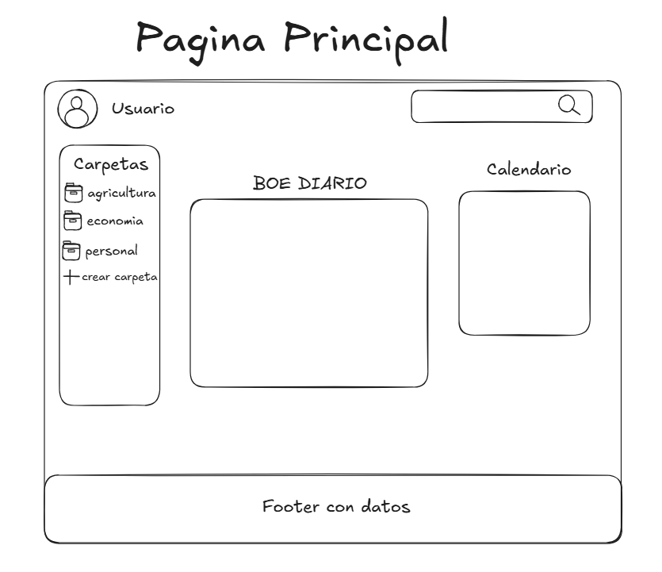
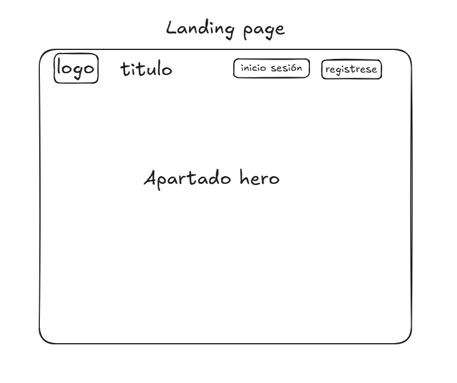
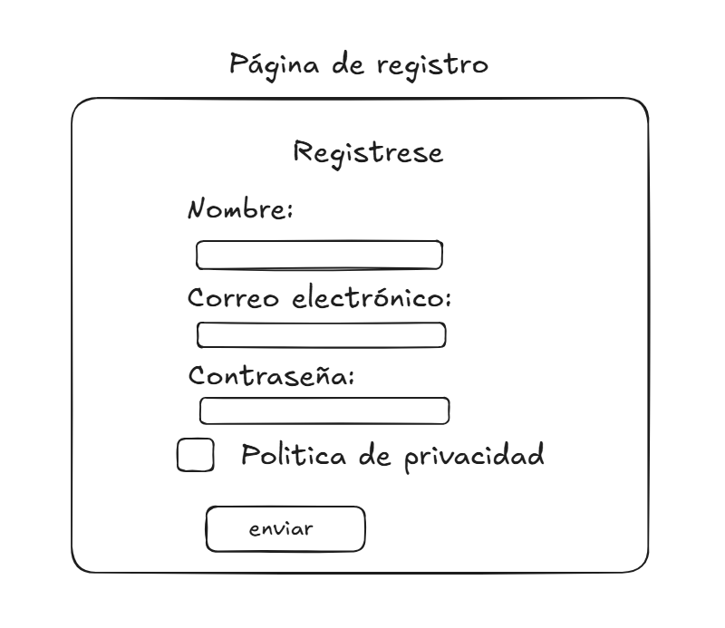
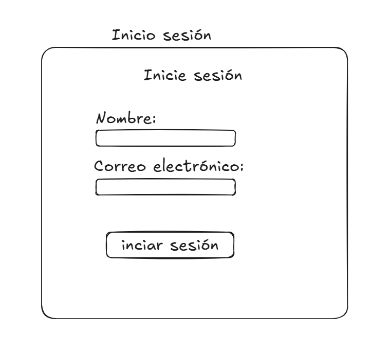
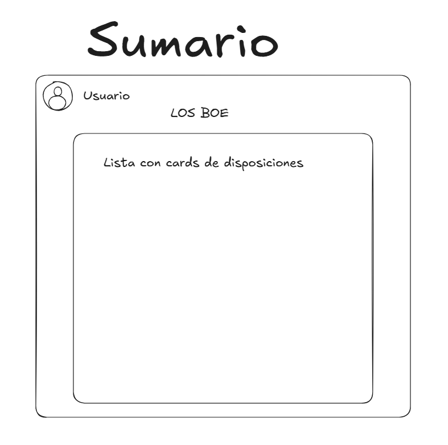
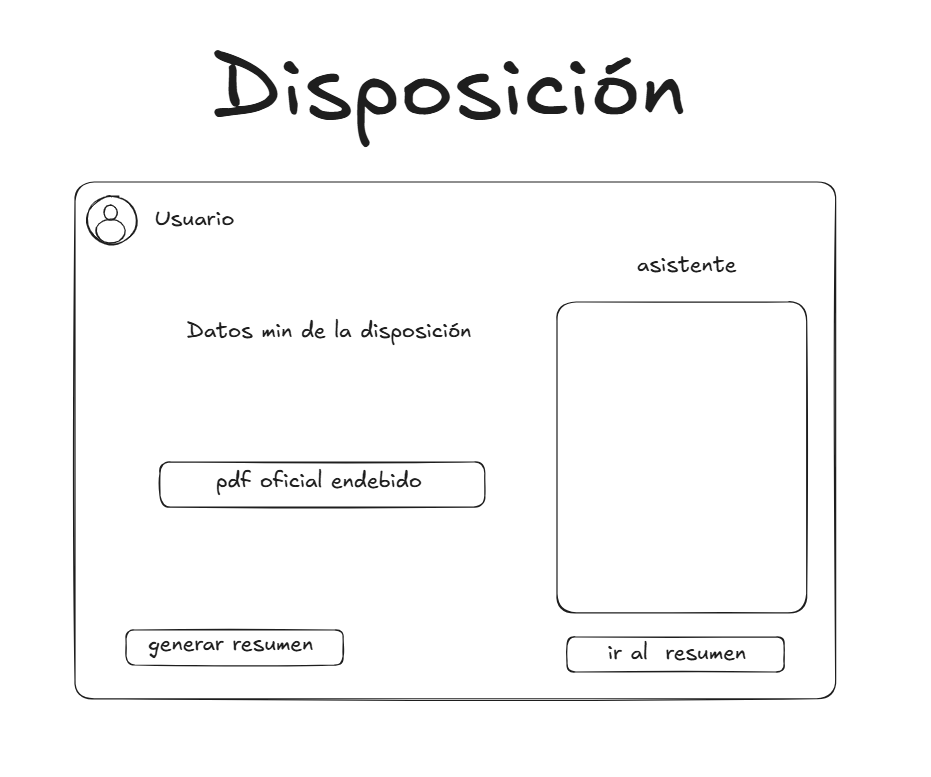

# Sistema de diseño UI - WIP

<a href="../README.md">Volver al README general</a>

<!-- TABLE OF CONTENTS -->

  
Tabla de Contenidos

  <ol>
    <li><a href="#mockups">Bocetos / Mockups</a></li>
    <li><a href="#philosophy">Filosofía de Diseño</a></li>
    <li><a href="#core-elements">Elementos Principales de la UI</a></li>
    <li><a href="#ux">Consistencia y Experiencia de usuario</a></li>
    <li><a href="#responsiveness">Responsividad</a></li>

<!-- Bocetos -->

## 1. Bocetos / Mockups

El diseño UI del proyecto parte de estos bocetos:

(<a href="#readme-top">back to top</a>)

<!-- Filosofía -->

## 2. Filosofía de Diseño: "Menos es más"

Para diseñar la interfaz de usuario he seguido la filosofía de "Menos es más". La idea es hacer una aplicación simple que muestre datos de manera limpia, así que he intentado crear un diseño consistente, intuitivo, limpio, suave y con bordes redondeados, que no distraiga al usuario de la lectura de información. Para conseguirlo, definí una serie de variables CSS en los estilos globales de aplicación, en el documento "styles.css".

En este apartado resumo algunos detalles como la paleta de colores o sistema de espaciado.
En otros apartados veremos que también definí algunas clases para establecer el layout general, y asegurar la consistencia del diseño visual y la responsividad.

Puedes ver los estilos globales de la app al completo [aquí](../src/styles.css)

Justo abajo muestro algunas variables que definí a nivel de raíz del proyecto `:root` en `styles.css`:

### Resumen Paleta de Colores

| Rol        | Valor (hex) | Variable CSS   |
| ---------- | ----------- | -------------- |
| Primario   | `#33786e`   | `--primary`    |
| Secundario | `#ffd54f`   | `--secondary`  |
| Background | `#f8fafc`   | `--background` |
| Superficie | `#ffffff`   | `--surface`    |
| Texto      | `#1e293b`   | `--text-main`  |
| Borde      | `#e2e8f0`   | `--border`     |

### Variables de espaciado (padding, margin, gap, etc.)

| Variable        | Valor             | Uso                 |
| --------------- | ----------------- | ------------------- |
| `--spacing-xs`  | `4px` / `0.25rem` | Gaps pequeños       |
| `--spacing-sm`  | `8px` / `0.5rem`  | Gaps iconos, inline |
| `--spacing-md`  | `16px` / `1rem`   | Padding estándar    |
| `--spacing-lg`  | `24px` / `1.5rem` | Padding de sección  |
| `--spacing-xl`  | `32px` / `2rem`   | Gaps grandes        |
| `--spacing-xxl` | `48px` / `3rem`   | Margenes de sección |

### Sombras suaves y bordes redondeados

Aquí muestro un ejemplo de una sombra y un border-radius definidos:

| Variable      | Valor                           | Uso                    |
| ------------- | ------------------------------- | ---------------------- |
| `--shadow-sm` | `0 1px 2px 0 rgb(0 0 0 / 0.05)` | Sombras pequeñas       |
| `--radius-md` | `12px`                          | Border-radius estándar |

(<a href="#readme-top">back to top</a>)

<!-- Elementos UI core -->

## 3. Elementos Principales de la UI

La UI consiste en que cuando abres por la página primero te lleva a la landing page la cual explica un poco la funcionalidad de la página y te permite tanto inciar sesión como registrarte para poder usar la página web.

Al iniciar sesión nos lleva al componente home el cual consiste en una página como de inicio en la cual puedes observar los distintos apartados de la página: como un input de tipo fecha la cual podrás seleccionar una para poder visualizar el BOE de una fecha en concreto, ver las distintas carpetas del usuario, etc..

Al buscar una fecha en el input te aparecerá el sumario del BOE de ese día,con toda la información que este conlleva separandote en tarjetas cada dato que contiene datos relevantes los cuales son clicables y te llevan a otra página con el pdf embebido y un asistente de IA para cualquier duda sobre esa normativa, cabe recalcar que en esa página también puedes descargarte los pdfs en el enlace que pone descargar pdf,Si le damos al enlace ver oficial nos llevará a la página oficial del boe de ese apartado, algo que no he mencionado es la existencia de los breadcrums los cuales están en toda la página web y nos permiten saber en donde estamos y volver atrás en cualquier momento.

En la página de sumario del BOE con la fecha tendremos 2 o 3 enlaces los cuales són descargar oficial, Anterior y Siguiente, descargar oficial te descarga el BOE al completo mientras que anterior te lleva al boe del día anterior o el primero que halla antes que el de la fecha otorgada debido a que los BOE no se realizan todos los dias mientras que siguiente hace lo mismo pero al reves y es por ello que digo que pueden haber 2 o 3 enlaces debido a que si estamos en el ultimo BOE publicado ese enlace no aparecerá.

(<a href="#readme-top">back to top</a>)

<!-- UX -->

## 4. Consistencia y Experiencia de usuario

(<a href="#readme-top">back to top</a>)

<!-- UX -->

## 5. Responsividad

(<a href="#readme-top">back to top</a>)

